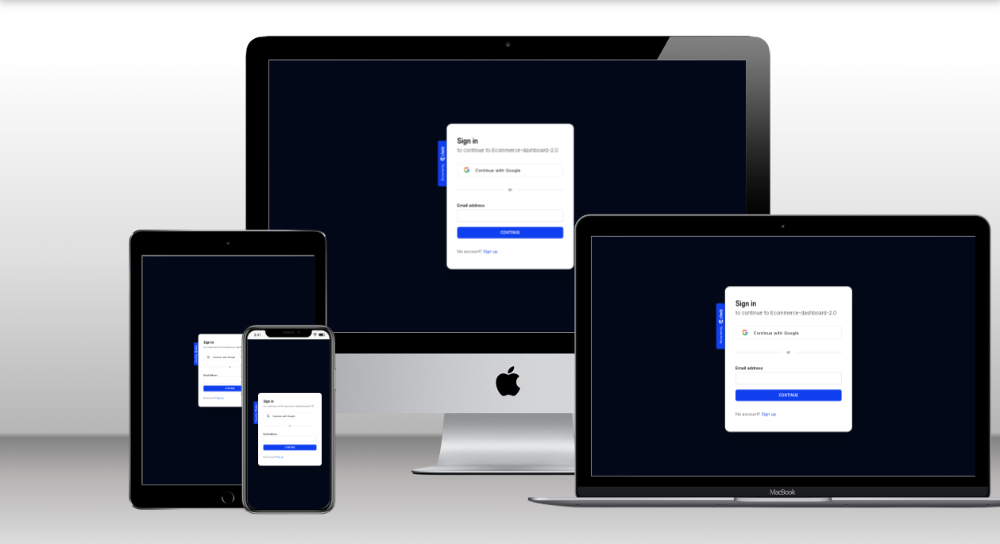

# Full Stack E-Commerce + Dashboard & CMS: Next.js 13 App Router, React, Tailwind, Prisma, Postgress

## Table of contents

- [Overview](#overview)
    - [The challenge](#the-challenge)
    - [Screenshot](#screenshot)
    - [Links](#links)
- [My process](#my-process)
    - [Built with](#built-with)
    - [What I learned](#what-i-learned)
    - [Continued development](#continued-development)
    - [Useful resources](#useful-resources)
- [Author](#author)
- [Acknowledgments](#acknowledgments)


## Overview

### The challenge

Users should be able to:

- Control mulitple vendors / stores through this single CMS! (For example you can have a "Shoe store" and a "Laptop store" and a "Suit store", and our CMS will generate API routes for all of those individually!)
- Create, update and delete categories!
- Create, update and delete products!
- Upload multiple images for products, and change them whenever you want!
- Create, update and delete filters such as "Color" and "Size", and then match them in the "Product" creation form.
- Create, update and delete "Billboards" which are these big texts on top of the page. You will be able to attach them to a single category, or use them standalone (Our Admin generates API for all of those cases!)
- Search through all categories, products, sizes, colors, billboards with included pagination!
- Control which products are "featured" so they show on the homepage!
- See your orders, sales, etc.
- See graphs of your revenue etc.
- Create Orders
- Checkout using stripe


### Screenshot




### Links

- Solution URL: [Github](https://github.com/mcwachira/ecommerce-admin-2.0)
- Live Site URL: [Live](https://ecommerce-admin-2-0.vercel.app)


For DEMO, use [Stripe Testing Cards](https://stripe.com/docs/testing)

Key Features:

### Prerequisites

**Node version 14.x**

### Cloning the repository

```shell
git clone https://github.com/mcwachira/ecommerce-admin-2.0.git
```

### Install packages

```shell
npm i
```

### Setup .env file


```js
NEXT_PUBLIC_API_URL=
```


### Start the app

```shell
npm run dev
```

## Available commands

Running commands with npm `npm run [command]`

| command         | description                              |
| :-------------- | :--------------------------------------- |
| `dev`           | Starts a development instance of the app |


### Built with

- Nextjs 13
- Tailwind css
- Shadcn ui
- Postgress + Prisma
-
- Mobile-first workflow

- [Next.js](https://nextjs.org/) - React framework
- [Tailwind css](https://tailwindcss.com/)- For styling
- [Shadcn Ui](https://ui.shadcn.com/) - For Components
- [Cloudinary](https://cloudinary.com/) - Store Images


### What I learned

- Learnt How to build a Ecommerce app from teh ground app to production
- Learnt How to use Nextjs 13 App router to build the App
- Learnt How to use Postgress to store my data
- Learn How to use Cloudinary to store Images


### Continued development

Use this section to outline areas that you want to continue focusing on in future projects. These could be concepts you're still not completely comfortable with or techniques you found useful that you want to refine and perfect.

**Note: Delete this note and the content within this section and replace with your own plans for continued development.**


## Author

- Website - [Add your name here](https://mcwachira.com)
- Twitter - [@mc_wachira](https:https://twitter.com/mc_wachira)


